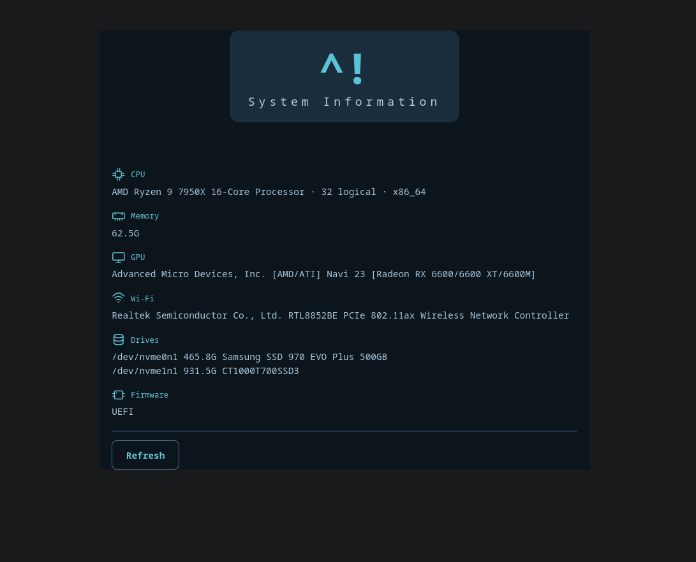

# beerfetch 🍺

A lightweight standalone system information tool for ArchBang and Arch-based systems.
Served locally via a minimal HTTP server and viewed in any browser.

```
CPU       Intel(R) Core(TM) i5-8500T · 6 logical · x86_64
Memory    15.5G
Drives    /dev/sda  238.5G  SAMSUNG MZ7LN256
          /dev/sdb  931.5G  ST1000LM035-1RK172
Firmware  UEFI
```



## Overview

beerfetch probes the local machine (lscpu, /proc/meminfo, lsblk) and serves a
clean browser-based overview on localhost. No external dependencies beyond Python
and the standard library. Icons are inline SVG — no font dependencies.

Inspired by neofetch/fastfetch but browser-based and built around ArchBang's
visual identity.

## Usage

```bash
python main.py
# then open http://localhost:7778
```

## Structure

```
beerfetch/
├── main.py          # entry point — starts the server and opens the browser
├── lib/
│   ├── parse.py     # pure parsers (unit-testable, no subprocess)
│   ├── system.py    # subprocess wrappers (lscpu, lsblk, /proc/meminfo)
│   ├── server.py    # minimal HTTP server + /api/sysinfo endpoint
│   └── ui.py        # HTML/CSS/JS panel
└── tests/
    └── test_sysinfo.py
```

## Requirements

- Python 3.8+
- Arch Linux / ArchBang (or any system with `lscpu`, `lsblk`, and `lspci`)

## License

MIT
